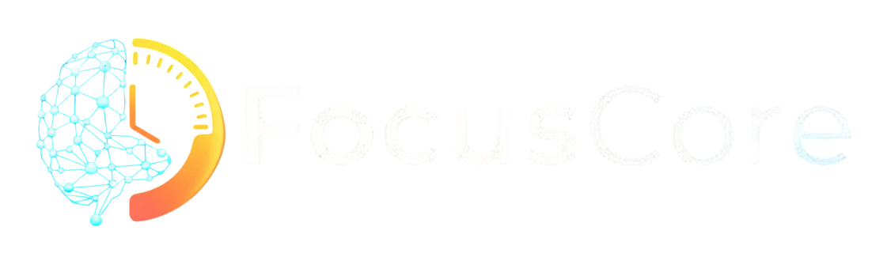

  
  
 
  
  **AI Destekli Odaklanma ve Üretkenlik Artırma Platformu**
  
  
  
  
  
  *Odaklanma gücünüzü artırın, hedeflerinize ulaşın! 🚀*

---

## ✨ **Özellikler**

### 🍅 **Pomodoro Timer**
- **Akıllı Zamanlama**: AI destekli optimal çalışma seansları
- **Özelleştirilebilir**: Çalışma ve mola sürelerini ayarlayın
- **Gerçek Zamanlı Takip**: Aktif seansları sidebar'da görün
- **İstatistikler**: Günlük ve haftalık performans analizi

### 📋 **Görev Yönetimi**
- **Akıllı Kategorileme**: Öncelik seviyeleri ve durum takibi
- **Filtreleme Sistemi**: Tamamlanan, bekleyen, yüksek öncelikli görevler
- **Pagination**: Büyük görev listelerinde kolay navigasyon
- **Batch İşlemler**: Toplu görev güncellemeleri

### 🤖 **AI Koç Asistan**
- **Kişiselleştirilmiş Tavsiyeler**: Performansınıza göre öneriler
- **Motivasyonel Mesajlar**: Günlük ilham verici içerikler
- **Performans Analizi**: Detaylı üretkenlik raporları
- **Akıllı İçgörüler**: AI destekli performans değerlendirmesi

### 📊 **İstatistikler & Analiz**
- **Gerçek Zamanlı Metrikler**: Anlık performans takibi
- **Görsel Grafikler**: Plotly ile interaktif grafikler
- **Trend Analizi**: Haftalık ve aylık performans eğilimleri
- **Hedef Takibi**: Günlük hedefler ve ilerleme

---

## 🚀 **Canlı Demo**

**🌐 [FocusCore'u Hemen Deneyin!](https://focuscore.streamlit.app/)**

---

## 🛠️ **Teknolojiler**

### **Frontend & Framework**
- **Streamlit** - Modern web uygulaması framework'ü
- **HTML/CSS** - Özelleştirilmiş UI bileşenleri
- **Plotly** - İnteraktif veri görselleştirme

### **Backend & API**
- **Python 3.10+** - Güçlü backend altyapısı
- **Google Gemini AI** - Yapay zeka destekli koçluk
- **Streamlit Cache** - Performans optimizasyonu

### **Veri Yönetimi**
- **Supabase** - Modern cloud veritabanı
- **Real-time Sync** - Anlık veri senkronizasyonu

### **Performans & Optimizasyon**
- **Lazy Loading** - Hızlı sayfa yüklemeleri
- **Smart Caching** - Akıllı veri önbellekleme
- **State Management** - Optimize edilmiş durum yönetimi
- **Batch Operations** - Toplu veri işlemleri

---

## 🎨 **UI/UX Özellikleri**

- **🌙 Dark Theme**: Göz yorgunluğunu azaltan karanlık tema
- **📱 Responsive Design**: Tüm cihazlarda mükemmel görünüm
- **⚡ Smooth Transitions**: Akıcı sayfa geçişleri
- **🎭 Skeleton Loading**: Modern yükleme animasyonları
- **🎯 Progressive Enhancement**: Aşamalı özellik yükleme

---

## 📞 **İletişim**

- **Website**: [https://focuscore.streamlit.app/](https://focuscore.streamlit.app/)
- **Email**: aksusenaa1@gmail.com
- **Developer**: Sena AKSU

---

  
<strong>FocusCore ile odaklanma gücünüzü artırın! 🚀</strong>

  
  

